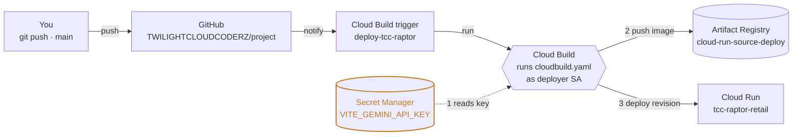
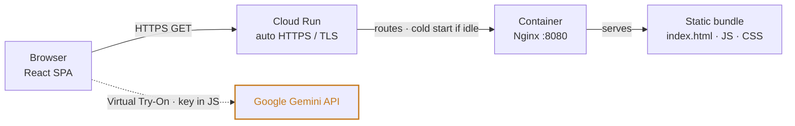
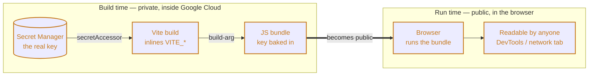

# TCC RAPTOR — Deployment Architecture

How a `git push` becomes a live site, and how that site serves every visitor, on **Google Cloud Run** with the Gemini key held in **Secret Manager**.

🔗 **Live:** https://tcc-raptor-retail-ru2czwsr6a-el.a.run.app

| | |
|---|---|
| **Project** | `deepan-gemini-xprize` |
| **Region** | `asia-south1` (Mumbai) |
| **Service** | `tcc-raptor-retail` |
| **CI/CD** | Cloud Build trigger on push to `main` |

---

## Table of Contents

- [The mental model: two lifecycles](#the-mental-model-two-lifecycles)
- [1. Deploy time — the CI/CD pipeline](#1-deploy-time--the-cicd-pipeline)
- [2. Request time — serving the site](#2-request-time--serving-the-site)
- [3. Where the Gemini key actually goes](#3-where-the-gemini-key-actually-goes)
- [4. Inside the build — two-stage Docker](#4-inside-the-build--two-stage-docker)
- [5. The identity model](#5-the-identity-model)
- [6. Local machine note (Norton / TLS)](#6-local-machine-note-norton--tls)
- [Resource reference](#resource-reference)
- [Redeploy](#redeploy)

---

## The mental model: two lifecycles

The system has **two independent lifecycles**:

- **Deploy time** runs *occasionally* — when you push code. It turns source into a running container.
- **Request time** runs *constantly* — on every visit. It serves the built site.

Most confusion about *"where does the API key live?"* disappears once you treat these as separate.

---

## 1. Deploy time — the CI/CD pipeline

Pushing to `main` is the **only** manual step. Everything after it happens inside Google Cloud, driven by `cloudbuild.yaml`.



**Step by step:**

1. **You push to `main`.** A commit lands on `TWILIGHTCLOUDCODERZ/project`. That's the entire manual step.
2. **GitHub notifies Cloud Build.** The GitHub connection (`tcc-github-conn`) forwards the push event; the trigger `deploy-tcc-raptor`, watching `^main$`, fires.
3. **Cloud Build runs `cloudbuild.yaml`** on a fresh, disposable VM that checks out that exact commit and executes **as the deployer service account** (not as you). It reads `VITE_GEMINI_API_KEY` from Secret Manager and runs `docker build`, passing the key as a build argument.
4. **The image is pushed** to Artifact Registry (`cloud-run-source-deploy`).
5. **Cloud Run rolls out a new revision** and shifts 100% of traffic to it. If the new revision fails to start, traffic stays on the previous one — a bad build can't take the site down.

---

## 2. Request time — serving the site

The deployed container is deliberately simple: **there is no application server** — just Nginx handing out pre-built static files. That's why it's cheap, fast, and scales to zero.



- **SPA routing:** Nginx returns `index.html` for any unknown path, so React Router handles deep links like `/product/42` on refresh.
- **Scale to zero:** with no traffic, Cloud Run runs zero instances (you pay nothing). The first request after idle spins one up — a brief "cold start" — then it stays warm.
- **Virtual Try-On calls Gemini _directly from the browser_** — that request never touches your server. This is exactly why the key must live in the client bundle.

---

## 3. Where the Gemini key actually goes

This is the one thing worth understanding precisely. Because the app is a static site compiled by **Vite**, any variable named `VITE_*` is **inlined into the JavaScript at build time**. Secret Manager protects the key in your *source and build* — but it cannot hide a value that, by design, ships to the browser.



**So what does Secret Manager buy you?** Real benefits — just not secrecy-from-users:

- **Out of git** — the key is never committed (`.env` is git-ignored).
- **Centralized** — rotate it in one place; the pipeline always reads `:latest`.
- **Access-controlled** — only the build's service account can read it.

What it *cannot* do is make a client-side key invisible to the people running your app.

> [!WARNING]
> **The real protection is an API-key restriction, not secrecy.** In Google AI Studio → API keys, add an **HTTP-referrer restriction** for `https://tcc-raptor-retail-*.run.app/*` and limit the key to the Generative Language API. Then a copied key is useless from any other origin.

> [!NOTE]
> The only way to keep the key truly private would be to add a small backend that holds it and proxies calls to Gemini — a larger change, out of scope for a static deploy.

---

## 4. Inside the build — two-stage Docker

The `Dockerfile` has two stages. The first is a full Node toolchain that compiles the app; the second is a tiny Nginx image containing **only** the compiled output. The bulky build tools never ship — the final image is small with almost no attack surface.

```dockerfile
# Stage 1 — build (Node): heavy, thrown away
FROM node:18-alpine AS builder
ARG VITE_GEMINI_API_KEY               # the key arrives here as a build-arg
ENV VITE_GEMINI_API_KEY=$VITE_GEMINI_API_KEY
RUN npm ci && npm run build            # Vite inlines VITE_* -> /app/dist

# Stage 2 — serve (Nginx): tiny, shipped
FROM nginx:alpine
COPY --from=builder /app/dist /usr/share/nginx/html
EXPOSE 8080                           # must match Cloud Run's port
```

Port `8080` is not arbitrary — it's the port Cloud Run sends traffic to, so Nginx is configured to listen there. The container runs as a non-root user.

---

## 5. The identity model

Automated builds don't run as you — they run as a dedicated, least-privilege **service account**, `cloudbuild-deployer`. It holds exactly what the pipeline needs and nothing more, so a compromised build can't roam the project.

| Role | Why the pipeline needs it |
|---|---|
| `secretmanager.secretAccessor` | Read the Gemini key during the build |
| `artifactregistry.writer` | Push the built image to the registry |
| `run.admin` | Create the new Cloud Run revision |
| `iam.serviceAccountUser` | Let the deploy act as Cloud Run's runtime identity |
| `logging.logWriter` | Write build logs |
| `storage.objectViewer` | Read uploaded source for manual builds |

One extra link makes triggered builds work: the Cloud Build service agent is granted permission to **impersonate** this deployer account, so the trigger can run the pipeline under that identity without your involvement.

---

## 6. Local machine note (Norton / TLS)

Norton 360 on the build machine intercepts HTTPS and re-signs it with its own certificate. Browsers accept that (it's in the Windows trust store), but command-line tools that ship their own certificate bundle reject it. Two fixes were applied:

- **git → schannel:** `git config --global http.sslBackend schannel` makes git trust the Windows certificate store.
- **gcloud → validation off:** `gcloud config set auth/disable_ssl_validation true` — a local-only setting; reverse it once Norton's HTTPS scanning is off.

> [!IMPORTANT]
> None of this affects the deployed app or the CI/CD pipeline — **those run in Google's cloud**, far from the laptop's antivirus. The workaround only matters for running `gcloud` locally.

---

## Resource reference

| Component | Name / value |
|---|---|
| GCP project | `deepan-gemini-xprize` |
| Region | `asia-south1` |
| Cloud Run service | `tcc-raptor-retail` |
| Secret | `VITE_GEMINI_API_KEY` |
| Artifact Registry repo | `cloud-run-source-deploy` |
| Deployer service account | `cloudbuild-deployer@deepan-gemini-xprize.iam.gserviceaccount.com` |
| GitHub connection → repo | `tcc-github-conn` → `tcc-raptor-repo` |
| Cloud Build trigger | `deploy-tcc-raptor` (branch `^main$`) |
| Pipeline definition | [`cloudbuild.yaml`](./cloudbuild.yaml) |
| Step-by-step runbook | [`DEPLOYMENT.md`](./DEPLOYMENT.md) |

---

## Redeploy

The whole pipeline is triggered by nothing but a commit:

```bash
git commit -m "change something" && git push origin main
```

Watch it run:

```bash
gcloud builds list --region asia-south1 --limit 1
```

Manual one-off deploy (no push):

```bash
gcloud builds submit --config cloudbuild.yaml \
  --service-account=projects/deepan-gemini-xprize/serviceAccounts/cloudbuild-deployer@deepan-gemini-xprize.iam.gserviceaccount.com \
  --region=asia-south1 .
```
