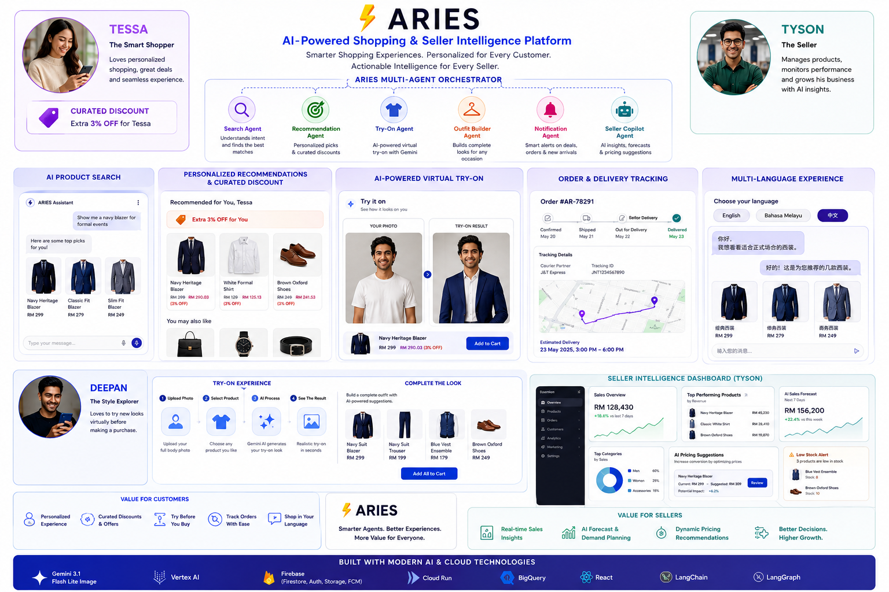
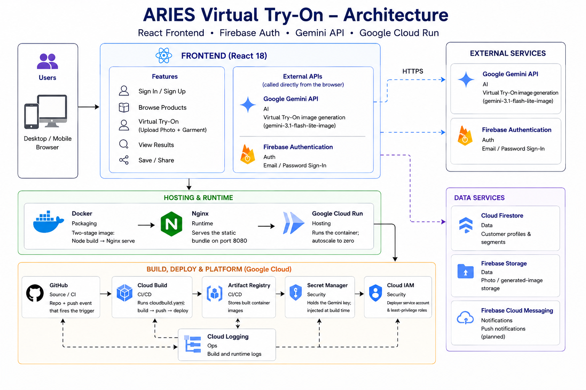
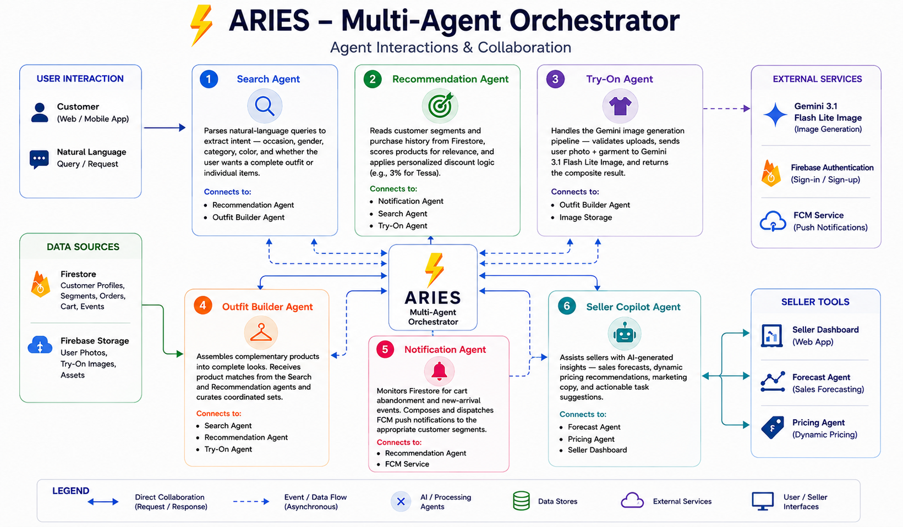

# TCC RAPTOR — AI-Powered Retail Virtual Try-On Platform

> Smarter shopping for customers, actionable intelligence for sellers — powered by the **ARIES** multi-agent AI system on Google Gemini.

[](https://tcc-raptor-retail-ru2czwsr6a-el.a.run.app)
[](https://react.dev)
[](https://www.typescriptlang.org)
[](https://vitejs.dev)
[](https://ai.google.dev)

**🔗 Live demo:** <https://tcc-raptor-retail-ru2czwsr6a-el.a.run.app>

**Created by** Deepan Raj — Senior Solution Architect (Azure, AWS & GCP) · **TCC RAPTOR** · [deepanrey@gmail.com](mailto:deepanrey@gmail.com)



---

## What is this?

An AI retail platform: customers browse, search in natural language, and **try clothing on their own photo** (Gemini 3.1 Flash Lite Image), while sellers get an AI dashboard with forecasts, dynamic pricing, and a copilot. The **ARIES** multi-agent orchestrator coordinates the search, recommendation, try-on, outfit-builder, notification, and seller-copilot agents.

**Highlights:** natural-language product search · personalized recommendations & discounts · AI virtual try-on · outfit builder · seller intelligence dashboard · multi-language UI · Aries voice chatbot.

---

## 🚀 How to Run

### Prerequisites

- **Node.js 18+** and **npm**
- A **Google Gemini API key** (for the Virtual Try-On feature) — create one in [Google AI Studio](https://aistudio.google.com/app/apikey)

### 1. Install dependencies

```bash
npm install
```

### 2. Configure environment

Create a `.env` file in the project root:

```env
VITE_GEMINI_API_KEY=your_gemini_api_key
```

> `VITE_*` variables are compiled into the app **at build time**. `.env` is git-ignored — never commit it. In production the key is injected from Google Secret Manager (see [Deployment](#️-deployment)).

### 3. Start the dev server

```bash
npm run dev
```

Then open the printed URL (Vite defaults to <http://localhost:5173>).

### 4. Build for production (optional, local)

```bash
npm run build     # outputs static site to dist/
npm run preview   # serve the production build locally
```

### All scripts

| Command | What it does |
|---|---|
| `npm run dev` | Start the Vite dev server with hot reload |
| `npm run build` | Production build → `dist/` |
| `npm run preview` | Preview the production build locally |
| `npm run typecheck` | Type-check with TypeScript |
| `npm run lint` | Lint with ESLint |

---

## 🧩 Architecture

The frontend is a React SPA; the browser calls **Gemini** and **Firebase Auth** directly, while the app is hosted on **Google Cloud Run**. The **ARIES** orchestrator coordinates the AI agents.





> ### 📐 Full architecture → **[ARCHITECTURE.md](./ARCHITECTURE.md)**
> Deploy pipeline & runtime request flow, build-time secret handling, and the IAM model — with detailed diagrams.

---

## ☁️ Deployment

Containerized (multi-stage **Docker → Nginx**) and running on **Google Cloud Run**. Every push to `main` auto-builds and deploys through **Cloud Build**, with the Gemini key injected from **Secret Manager** at build time.

```bash
git push origin main   # → Cloud Build → new Cloud Run revision (~4 min)
```

> ### 🚀 Full deploy runbook → **[DEPLOYMENT.md](./DEPLOYMENT.md)**
> Step-by-step: GCP project setup, Secret Manager, Artifact Registry, the Cloud Build trigger, and Cloud Run.

---

## 🛠️ Tech Stack

| Layer | Technology |
|---|---|
| **Frontend** | React 18 · TypeScript · Vite · Tailwind CSS · React Router · Lucide |
| **AI** | Google Gemini 3.1 Flash Lite Image |
| **Backend** | Firebase (Firestore · Auth · FCM · Storage) |
| **Hosting** | Google Cloud Run (Nginx, scale-to-zero) |
| **CI/CD** | GitHub → Cloud Build → Artifact Registry → Cloud Run |
| **Secrets** | Google Secret Manager |

---

## 📁 Project Structure

```
.
├── src/
│   ├── components/    # UI components (Header, modals, ProductCard, VirtualTryOn…)
│   ├── pages/         # Routes (Home, Product, Category, seller/*)
│   ├── context/       # Auth, Cart, SellerAuth React contexts
│   ├── lib/           # aiSearch, firebase, ariesEngine
│   ├── data/          # Product catalog & seller mock data
│   └── public/        # Static assets (product images + README diagrams)
├── Dockerfile         # Multi-stage build → Nginx (port 8080)
├── nginx.conf         # Static serving + SPA fallback
├── cloudbuild.yaml    # CI/CD pipeline: build → push → deploy
├── ARCHITECTURE.md    # As-built architecture & pipeline (diagrams)
└── DEPLOYMENT.md      # Step-by-step deploy runbook
```

---

## 📚 Documentation

| Document | What's inside |
|---|---|
| [ARCHITECTURE.md](./ARCHITECTURE.md) | How the deploy pipeline & runtime work — diagrams, secret handling, IAM |
| [DEPLOYMENT.md](./DEPLOYMENT.md) | Step-by-step deploy runbook (GCP → Secret Manager → Cloud Build → Cloud Run) |

---

## License

Proprietary to TCC RAPTOR. All rights reserved.
